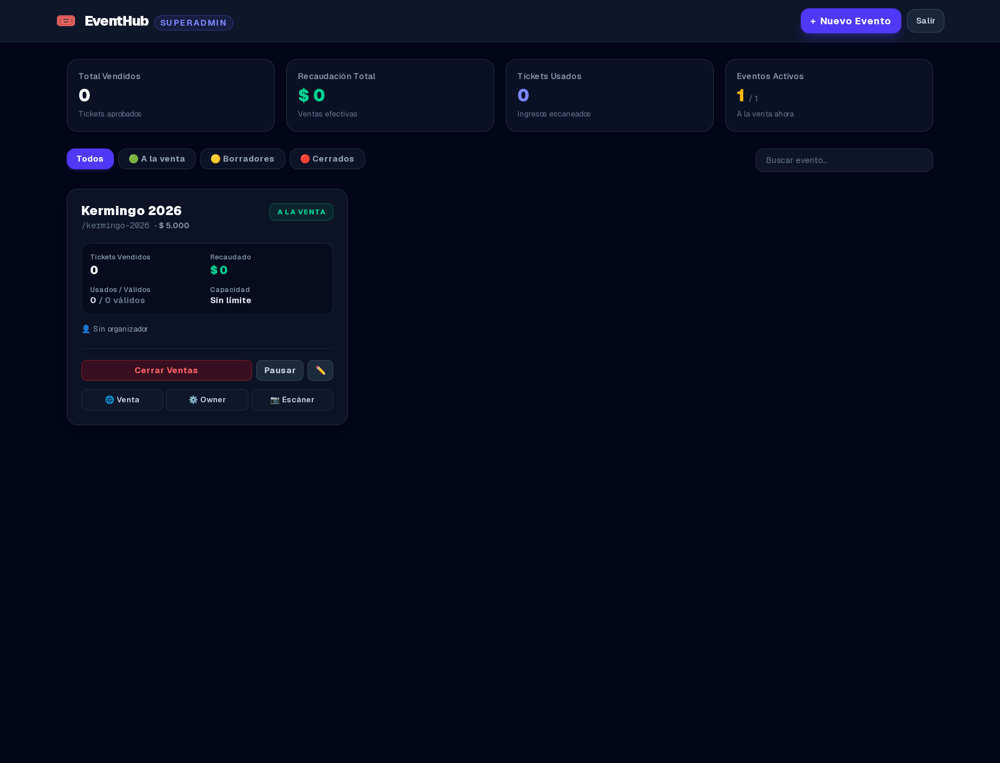
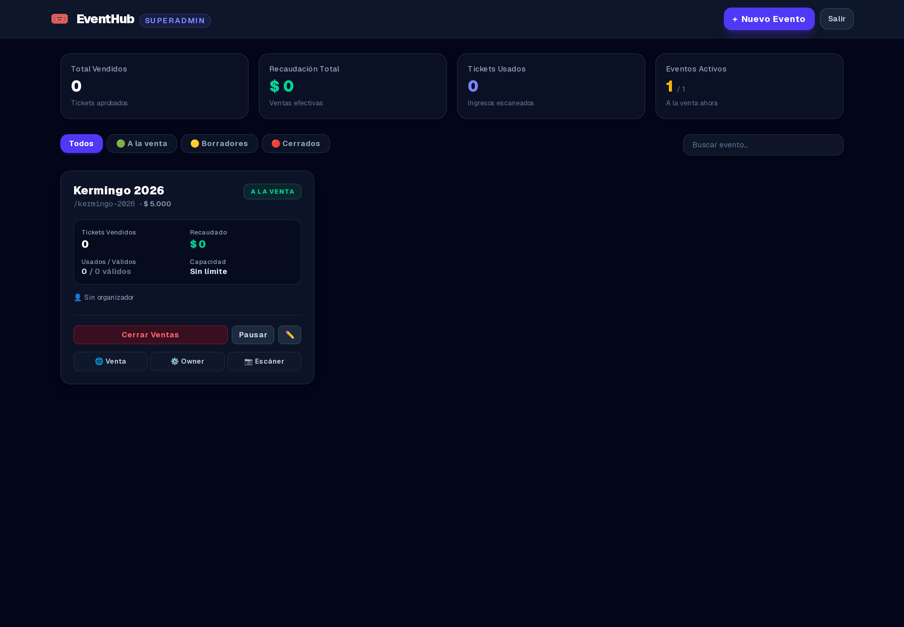
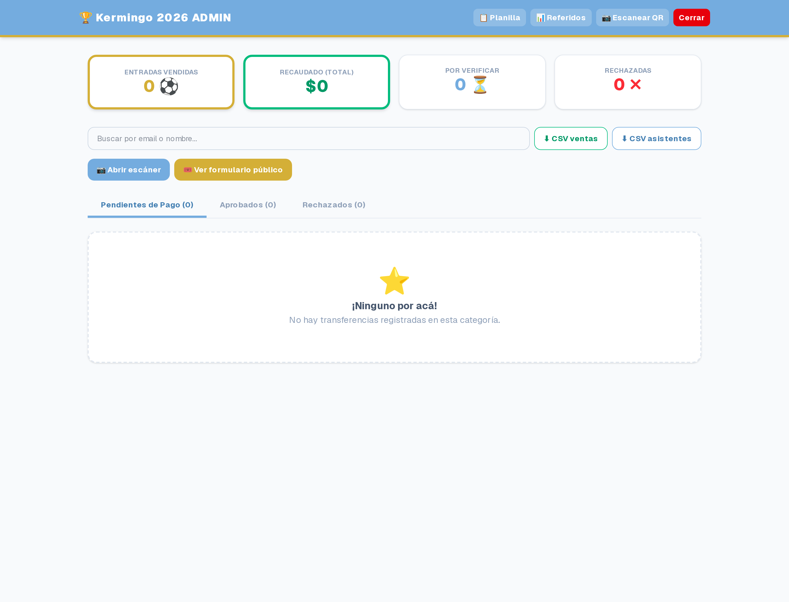
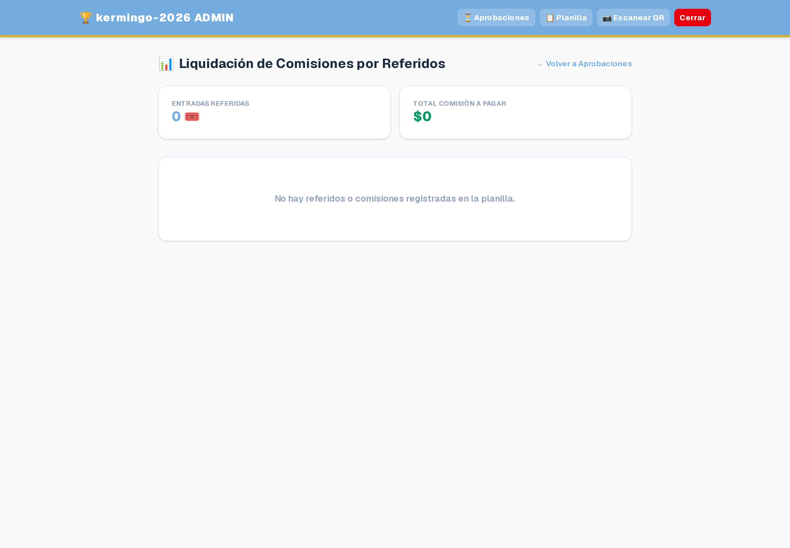
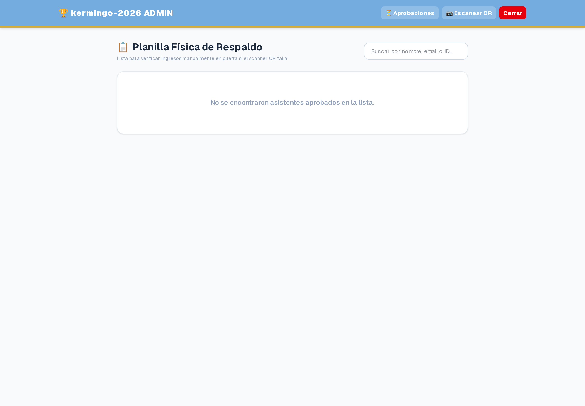
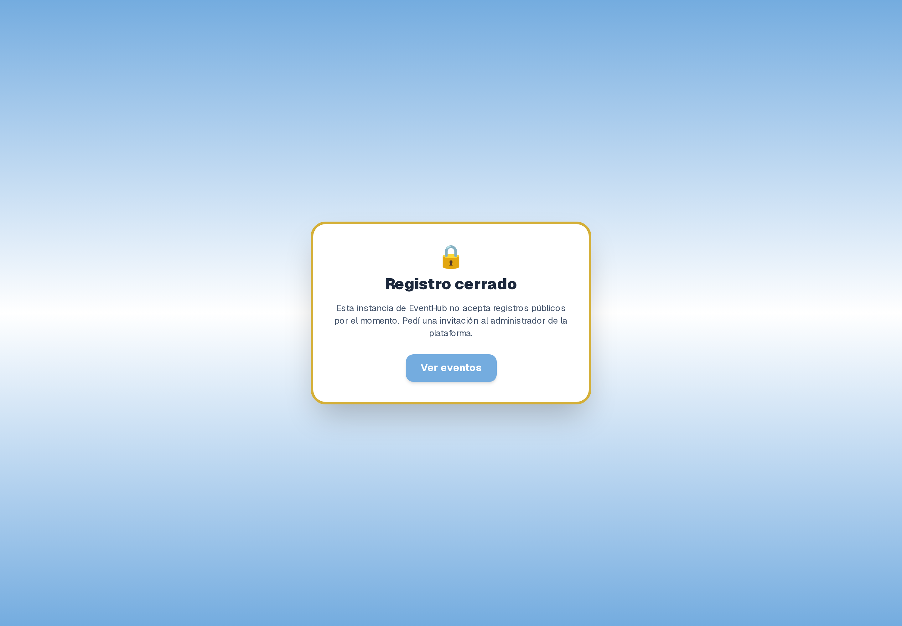
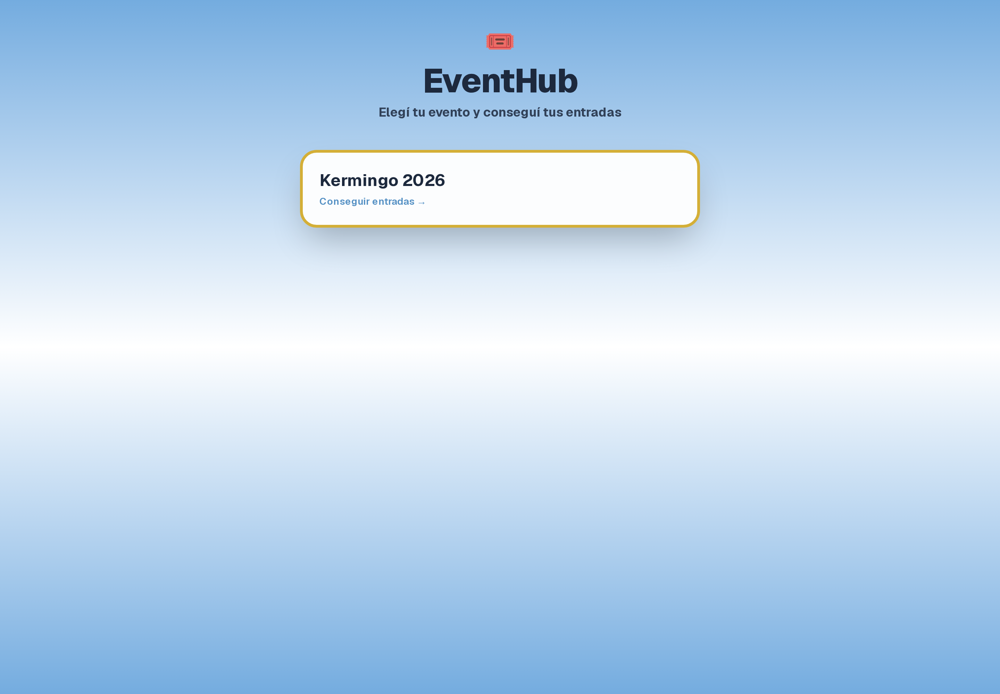
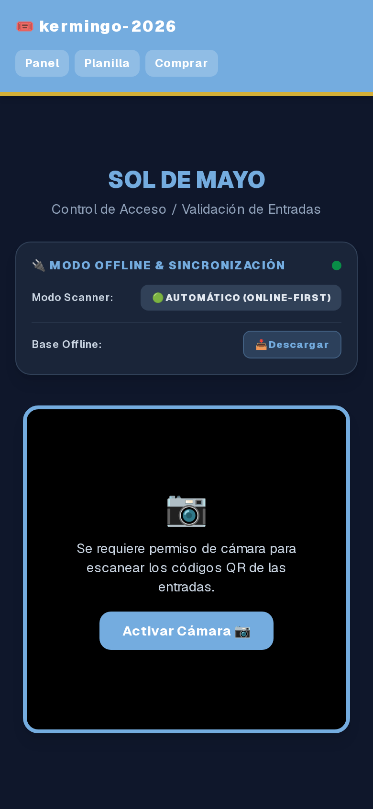
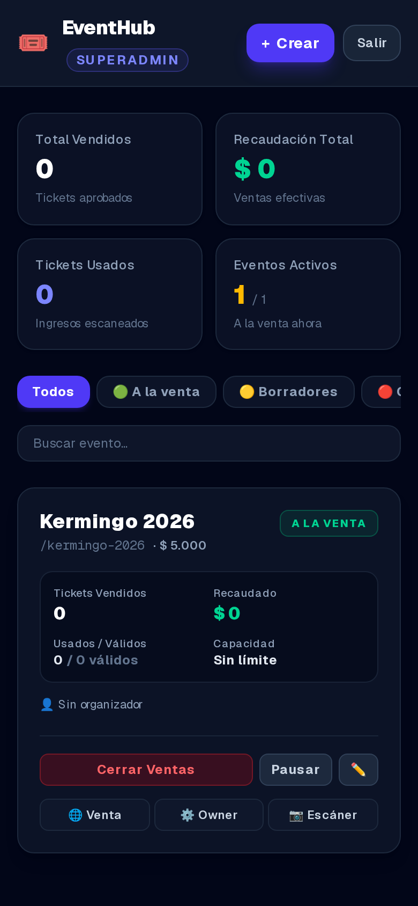

# EventHub — Entradas Multi-Evento

EventHub es una plataforma de venta de entradas con escaneo QR y panel de gestión.
Un solo deploy sirve **N eventos de N dueños distintos**, cada uno con su marca, precio, alias de pago y equipo de escaneo, con aislamiento total de datos entre eventos.

---

## 🛠️ Stack Tecnológico

- **Frontend/Backend:** Next.js 16 (App Router) con soporte Turbopack.
- **Base de Datos:** PostgreSQL en Supabase (tenant = fila con `event_id`, no DB por evento).
- **ORM:** Prisma Client.
- **Auth:** cookie firmada HS256 (`AUTH_SECRET`) con `{eventId, role}`; roles `superadmin` / `owner` / `scanner`; passwords de dueño con argon2id.
- **Envío de Correos:** Nodemailer (SMTP de plataforma, `reply-to` del dueño).
- **Comprobantes:** object storage (Cloudflare R2 o Vercel Blob) con fallback base64 en DB (`STORAGE_MODE`).
- **Control de Accesos:** lector QR integrado en cliente (HTML5-QRCode), offline-first por evento.

---

## 🗺️ Rutas

| Ruta | Qué es |
|---|---|
| `/` | Home: lista eventos `ON_SALE` |
| `/eventos` | Listado público de eventos |
| `/[slug]` | Compra de entradas del evento |
| `/[slug]/escaner` | Escáner QR del evento (owner/scanner) |
| `/[slug]/admin` | Panel del dueño (login scoped por evento) |
| `/panel` | Panel del superadmin: crear y gestionar eventos sin tocar código |
| `/invitacion?token=...` | Activación del dueño invitado (setea su password) |
| `/api/events` | JSON de eventos a la venta |
| `/api/admin/platform-stats` | Stats por evento (solo superadmin) |
| `/api/keep-alive` | **Único** ping de keep-alive de la plataforma |

Rutas legacy (`/admin`, `/escaner`) redirigen 308 a `/kermingo-2026/...`.

---

## 👥 Roles

| Rol | Qué puede hacer | Cómo entra |
|---|---|---|
| `superadmin` | Dueño de la instancia. Crea/edita eventos desde `/panel`, invita dueños, ve stats de todos los eventos. | Login en `/panel/login` con `SUPERADMIN_EMAIL` + `SUPERADMIN_PASSWORD` del `.env`. |
| `owner` | Dueño de UN evento. Aprueba/rechaza comprobantes, ve ventas y asistentes, gestiona promoters, edita precio/alias de su evento. Solo ve su `event_id` (cualquier intento de ver otro evento = 403). | Invitación por email del superadmin → activa su cuenta en `/invitacion?token=...` con password propia (argon2id). Login en `/[slug]/admin`. |
| `scanner` | Solo check-in: valida tickets en `/[slug]/escaner`, online u offline. No ve aprobaciones ni ventas. | Link de acceso del evento (rol `scanner` en la cookie de sesión). |

---

## 🖼️ Capturas

Capturas reales de una instancia en producción (generadas con `scripts/` del repo +
Playwright, ver `docs/screenshots/README.md`).

### Panel de superadmin — crear y gestionar eventos sin tocar código

| Métricas de la plataforma | Crear evento |
|---|---|
|  |  |

### Panel del dueño de cada evento

| Ventas y aprobación de comprobantes | Promoters y ranking |
|---|---|
|  |  |

| Planilla de asistentes | Alta de organizador |
|---|---|
|  |  |

### Público y escáner (mobile-first)

| Home | Escáner QR (offline-first) | Panel en celular |
|---|---|---|
|  |  |  |

- **Home (`/`)**: lista de eventos a la venta, cada uno con su nombre y link a su página de compra.
- **Compra (`/[slug]`)**: formulario con nombre, email, cantidad, comprobante de pago (comprimido en cliente) y código de referido opcional.
- **Panel superadmin (`/panel`)**: métricas por evento (vendidos, recaudado, usados vs válidos, % capacidad), crear evento con slugify en vivo, editar config y estado (`DRAFT`/`ON_SALE`/`CLOSED`), reenviar invitaciones.
- **Panel del dueño (`/[slug]/admin`)**: ventas, recaudación, tickets validados/restantes, tabla de compras con aprobar/rechazar, promoters y ranking.
- **Escáner (`/[slug]/escaner`)**: lector QR con modo offline-first (planilla pre-cargada por evento).

---

## 🚀 Self-host paso a paso (levantar tu propia instancia de cero)

### Requisitos

- Node.js 20+ y npm.
- Un proyecto **Supabase propio** (free tier alcanza): necesitás la URL con pooling (puerto 6543, `DATABASE_URL`) y la directa (puerto 5432, `DIRECT_URL`). Ambas están en el dashboard de Supabase → Settings → Database.
- Una cuenta SMTP para enviar confirmaciones e invitaciones (Gmail con App Password, Resend, SendGrid...).
- Cuenta de Vercel (o cualquier host Node) para el deploy.

### 1. Clonar e instalar

```bash
git clone <tu-fork-de-eventhub>
cd eventhub
npm install
```

### 2. Crear tu proyecto Supabase y correr las migraciones

1. Creá un proyecto nuevo en [supabase.com](https://supabase.com) y anotá `DATABASE_URL` (pooling, 6543) y `DIRECT_URL` (directa, 5432).
2. Aplicá el schema sobre **tu** base (nunca sobre la de otro):

```bash
cp .env.example .env   # y completá DATABASE_URL y DIRECT_URL con las de TU proyecto
npx prisma migrate deploy
```

Esto ejecuta en orden las migraciones de `prisma/migrations/` (incluye backfill del evento demo).

3. Cargá el evento demo + promoters de ejemplo:

```bash
npx tsx prisma/seed.ts
```

### 3. Variables de entorno

Copiá `.env.example` a `.env`. Obligatorias vs opcionales:

| Variable | Obligatoria | Para qué |
|---|---|---|
| `DATABASE_URL` | ✅ | Postgres con pooling (serverless) |
| `DIRECT_URL` | ✅ | Conexión directa (migraciones) |
| `AUTH_SECRET` | ✅ | Firma HS256 de cookies (mín. 32 caracteres aleatorios) |
| `SUPERADMIN_EMAIL` / `SUPERADMIN_PASSWORD` | ✅ | Primer acceso a `/panel` |
| `SMTP_HOST` / `SMTP_PORT` / `SMTP_USER` / `SMTP_PASS` / `SMTP_FROM` | ✅ para emails | Confirmaciones de compra e invitaciones a dueños |
| `STORAGE_MODE` | No (`db`) | `db` = comprobantes base64 en Postgres (simple, gasta espacio); `r2` / `blob` = object storage en producción |
| `R2_*` | Solo si `STORAGE_MODE=r2` | Cloudflare R2 (free 10GB) |
| `BLOB_READ_WRITE_TOKEN` | Solo si `STORAGE_MODE=blob` | Vercel Blob |
| `NEXT_PUBLIC_SITE_URL` | No | URL pública (links de invitación en emails) |
| `ALLOWED_DB_PROJECT_REFS` | No | Allowlist de project refs; si se define, Prisma se niega a correr contra otra DB |
| `ALLOW_DB_PUSH` | No (`0`) | Poner `=1` solo para correr comandos DDL (`db push`, `migrate`, `studio`) a propósito |

> ⚠️ Nunca commitees `.env` con valores reales. El repo ignora `.env*` excepto `.env.example`.

### 4. Primer arranque local

```bash
npx prisma generate
npm run dev   # http://localhost:3000
```

Verificá: `npx vitest run` (tests) y `npm run lint`.

### 5. Crear tu primer evento y su dueño (persona no técnica, sin tocar código)

1. Entrá a `/panel/login` con `SUPERADMIN_EMAIL` + `SUPERADMIN_PASSWORD`.
2. En `/panel`, botón crear evento: nombre, slug (se sugiere solo), precio, email del dueño → **Crear**.
3. Al dueño le llega un email con su link de invitación (válido 24h, un solo uso).
4. El dueño abre el link, setea su password y queda como `owner` de su evento.
5. El evento se publica pasando su estado a `ON_SALE`; aparece en `/` y vende en `/[slug]`.

### 6. Deploy en Vercel

1. Importá el repo en Vercel.
2. Cargá las mismas variables de entorno del `.env` en Project → Settings → Environment Variables.
3. Build command por defecto (`npm run build` ya corre `prisma generate`).
4. Apuntá un cron (ej. cron-job.org) cada 5 min a `https://<tu-app>.vercel.app/api/keep-alive` para evitar el cold start de la DB.

---

## 🏗️ Arquitectura y Optimizaciones del Sistema

Diseñado con foco en tolerancia a fallos, límites estrictos de almacenamiento y resiliencia en el día del evento.

### 1. Aislamiento multi-tenant

Todo query lleva `event_id` obligatorio (incluido el escáner: un ticket de otro evento responde `TICKET NOT FOUND`, nunca se quema). Tests de aislamiento en `src/__tests__/isolation.test.ts`.

### 2. Comprobantes fuera de Postgres

`receipt_url` es URL de object storage (R2/Blob) y el archivo se comprime en cliente (`compressImage`: JPEG calidad 60%, máx 1200px, 70-150KB). Fallback base64 detrás de `STORAGE_MODE=db|r2|blob`. Al rechazar/eliminar una compra se borra el objeto físico.

### 3. Cuotas anti-abuso por evento

Checkout limitado a 10 compras/hora por `(event_id, IP)` (429) y `EventConfig.max_tickets` cierra la venta sola (403). Tests en `src/__tests__/quotas.test.ts`.

### 4. Blindaje de Conexiones a PostgreSQL (Connection Pooler)

- **Problema:** en serverless, Vercel escala horizontalmente y satura el límite de conexiones.
- **Solución:** en `src/lib/db.ts` pool acotado por instancia serverless.

### 5. Keep-Alive único de plataforma

- **Problema:** Supabase/Neon suspende la DB tras inactividad; el primer escaneo sufre cold start.
- **Solución:** ruta `/api/keep-alive` con consulta ligera (`SELECT 1`).
- **Despliegue:** un solo ping cada 5 minutos a `https://<tu-app>.vercel.app/api/keep-alive` (ej. cron-job.org). **Ya no hay una URL por evento.**

### 6. Sistema de Validación QR Offline-First

- **Planilla Offline:** pre-carga de entradas aprobadas a `localStorage` con claves prefijadas por slug (`eh_<slug>_offline_db`).
- **Validación Local:** modo offline valida localmente y marca como usadas al instante.
- **Cola de Sincronización:** ingresos offline se suben en lote al recuperar red.

---

## 📜 Licencia y uso comercial

MIT — ver `LICENSE`. Podés usar, modificar, vender y self-hostear EventHub libremente, incluso con fines comerciales; la única condición es conservar el aviso de copyright. Sin garantía de ningún tipo.

---

## 🤖 Cómo se construyó

EventHub se construyó con **dos agentes autónomos** coordinados por un tablero Notion (`EventHub Tasks`):

- **PM:** Antigravity CLI (`gemini-3.8-flash-medium`) — diseño de schema, auth multi-rol, storage, onboarding, review de PRs.
- **Contributor:** Command Code (`muse-spark-1.3`) — scoping por `event_id`, ruteo por slug, mailer templado, cuotas, plataforma, docs.

El flujo de delegación (prompts, dispatch, rondas) está versionado en [`delegacion/`](delegacion/) y el plan de conversión single-event → multi-evento en `.hermes/plans/2026-09-18_eventhub-multievento.md`.

---

## 💻 Desarrollo Local (resumen)

```bash
npm install
npx prisma generate   # nunca db push/migrate contra producción sin autorización
npm run dev
npx vitest run
npm run lint
npm run build
```

Ver `CONTRIBUTING.md` para la guía completa de contribución.
